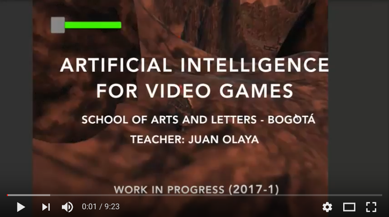

# Artificial Intelligence for Video Games (Unity and Mixamo)

This repository is associated with the subject Artificial Intelligence for Video Games taught in the university School of Arts and Letters (Bogotá) by Juan Olaya in the semester 2017.1.

De manera individual programar en Unity 5 un videojuego RPG (Third Person) utilizando los conceptos de Inteligencia Artificial vistos en clase:

# AI BEHAVIOURS FOR VIDEOGAMES

Implementación de Non-player character (Personaje autónomo)
Pursuing Behavior (Comportamiento de persecución)
Attacking Behavior (Comportamiento de ataque)
Patrolling Behavior (Comportamiento de patrullaje)
Pathfinding (Ruta más corta)
Retorno a Patrolling cuando el enemigo no esté en estado de persecusión. Visto en clase
Dying Behavior (Comportamiento Moribundo): Para personaje principal y enemigo
Jumping (Saltar) : De acuerdo a la información que envié al correo
Utilizando Any State: En el personaje principal implementar comportamientos de Ataque. En mi caso utilicé Kicking (Patada) y Punching (Puñetazo).
https://drive.google.com/drive/folders/0B03A1dZhlfGFeTBPdkF1S09tSDg?usp=sharing
Reacción de puño o patada: Para personaje principal y los enemigos. Yo utilicé la animación Shove Reaction de Mixamo
Adicionalmente, incluir en el videojuego:

Personajes diferentes (1 player, enemigos, transeuntes, animales) asociadas a su narrativa interactiva.

Animaciones Mixamo asociadas a su narrativa interactiva.

Grupos de enemigos autónomos (Non-Player Character)

Gestión de salud de los enemigos autónomos. Y gestionar la salud del personaje principal (player) Tip: Utilizar Colliders de Unity 5 para gestionar la salud.
Utilizar Assets de modelos 3D y texturas de cualquier proveedor asociadas a su narrativa interactiva.

NO es permitido utilizar Assets de proveedores externos, aunque estén en la Asset Store, para modificar la lógica del videojuego (AI, Cámaras...). Si se propone un Asset consultar con el profesor antes de la utilización en el proyecto. 

# MANAGEMENT AI BEHAVIOURS 
Gestión de comportamientos por medio de Finite State Machine (Máquina de Estados Finitos)
https://docs.unity3d.com/es/current/Manual/StateMachineBasics.html

Mezcla de comportamientos por medio de Blend Trees (Árboles de Mezcla)
https://docs.unity3d.com/es/current/Manual/class-BlendTree.html

# AI BIBLIOGRAPHY
[The Ghost in the Machine](https://www.amazon.com/Ghost-Machine-Arthur-Koestler/dp/1939438349/ref=sr_1_1?s=books&ie=UTF8&qid=1489518939&sr=1-1&keywords=ghost+in+the+machine)

# STUDENT PROJECTS
The students designed and developed (###) Entertainment Games using Unity in the course Artificial Intelligence for Video Games. This course was taught in the second semester of the year 2017. The video below shows these projects:

  

# AI LINKS

# VIDEOGAMES TOOLS
https://poly.google.com/
