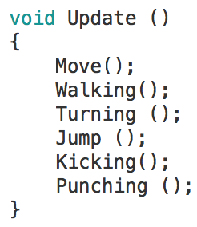

# ARTIFICIAL INTELLIGENCE (UNITY + MIXAMO)

This repository is associated with the course Artificial Intelligence for Video Games taught in the university [School of Arts and Letters](https://artesyletras.com.co/ingenieria-de-las-artes-digitales/) (Bogotá) by Juan Olaya in the semester 2017.1. For this course we use [Unity 3D](https://unity3d.com/) as game engine and [Mixamo](https://www.mixamo.com/) as 3D animated characters repository.

### 1. Animated Characteres and AI Behaviours for Video games

For this course we developed a third person video games. We use Non-Player Characters (NPC) as enemies with the following AI Behaviours:

- Patrolling Behaviour
- Pursuing Behaviour (Pathfinding)
- Attacking Behaviour
- Return to patrolling when the chase is canceled (Pathfinding)

Also, we implemented the following non-artificial intelligence behaviours for the movement of the main character:
- Idle
- Walking
- Turning
- Jumping
- Kicking
- Punching 

And for both, the main character and Non-Player Characters we implemented:
- Dying Behaviour
- Shove Reaction 

### 2. Blend Trees  (Animator window) 

At the beginning of this course we focused on the implementation of main character's movement. We use the Animator window of Unity and its functionality [Blend Trees](https://docs.unity3d.com/Manual/class-BlendTree.html). This functionality allows us blend character's animations. For instance, from walking to running. In the Animator Controller we blend the following character's animations:

- Idle to Turn Right and Turn Left
- Walk Backward to Walk Backward Right and Walk Backward Left
- Walk Bacward to Idle and Walk Forward

  

Assigment: Create a Blend Tree to manage the animations related with the motion of the main character that we spoke above. Use the Animator window of Unity. Also create an interface script that map the input of the keyboard and the Animator Controller.

  

### 3. Finite State Machine (Animator window)  
We use the functionality of Unity [Finite State Machine](https://docs.unity3d.com/es/current/Manual/StateMachineBasics.html) using the Animator window to manage the behaviours that must available in any moment with Any State including the Blend Tree associated with the main character's movement.

  

Assigment: Create an Animator Controller and use the Animator window to create transitions From "Any State" to link and manage the following state (animations):
- Jumping
- Kicking
- Punching 
- Dying
- Punching Reaction
- Includign the Blend Tree

### 4. Chasing Script (Navmesh)

Assigment: Create 5 waypoints in the Scene View of Unity and locate a Non-Player Character (enemy) near of these waypoints. Create a [Navmesh](https://docs.unity3d.com/Manual/nav-BuildingNavMesh.html) taking into account the obstacles and the tilts of the terrain. Create a script that manage the movement of the Non-Player Characters with the following AI behaviours:
- Patrolling Behaviour
- Attacking Behaviour
- Pursuing Behaviour (Pathfinding with Navmesh)
- Return to patrolling when the chase is canceled (Pathfinding with Navmesh)

  

### 5. Software Patterns for Health Player Management 

Assignment 1: Manage the health for the main character and the enemies. For this assignment, you must to detect the collisions between NPC and the main properly using scritping and colliders in Unity. Then, create a health bar (HUD) that shows the amount of health for the main character. Take into account that this script must to management the Dying Behaviour and the Shove Reaction (character animations)

Assignment 2: Identify the software patterns that have been used by these scripts. Recommended Book: [Game Programming Patterns, Nystrom (2014) - Online version](http://gameprogrammingpatterns.com/contents.html)

### 6. Interactive Experience
For the video game is relevant includ the concepts of Game Design, such as: goals, score, rules, awards, convincing mechanics and vivid interactive storytelling. In addition, it is important to enrich the video game experience with:
- Waypoints (to move characters, animals or vehicles around)
- Textures
- Physics Simulation
- Explosion Simulation
- Sound Effects

### AI Bibliography
- [Game Programming Patterns, Nystrom (2014) - Online version](http://gameprogrammingpatterns.com/contents.html)
- [The Ghost in the Machine, Koestler (1982)](https://www.amazon.com/Ghost-Machine-Arthur-Koestler/dp/1939438349/ref=sr_1_1?s=books&ie=UTF8&qid=1489518939&sr=1-1&keywords=ghost+in+the+machine)
- [A Study Path For Game Programmer, Yip (2016)](https://github.com/miloyip/game-programmer)

- [Artificial Intelligence: A Modern Approach, Russell (2009)](https://www.amazon.com/Artificial-Intelligence-Modern-Approach-3rd/dp/0136042597/ref=sr_1_1?s=books&ie=UTF8&qid=1517513059&sr=1-1)

### Student Projects
The students designed and developed 4 Entertainment Games using Unity in the course Artificial Intelligence for Video Games. This
course was taught in the second semester of the year 2017.1 The video below shows these projects:

  

***

### Video Game Resources
- [Unity Manual](https://docs.unity3d.com/Manual/UnityManual.html)
- [Unity Scripting API](https://docs.unity3d.com/ScriptReference/index.html)
- [Google Poly](https://poly.google.com/)
- [Asset Store](https://www.assetstore.unity3d.com)
- [Textures](https://www.textures.com/)
