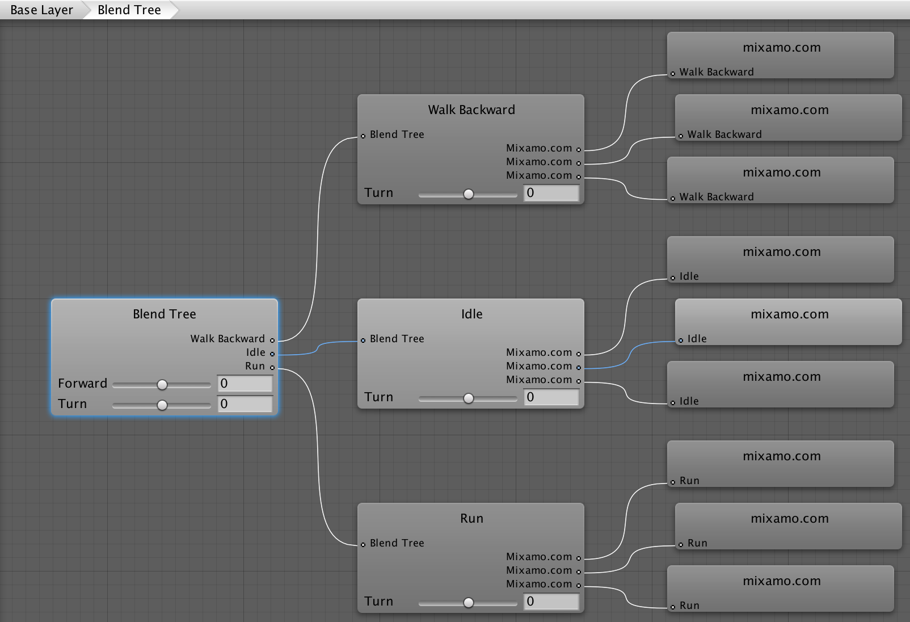

# ARTIFICIAL INTELLIGENCE FOR VIDEO GAMES (Unity)

This repository is associated with the subject Artificial Intelligence for Video Games taught in the university [School of Arts and Letters](https://artesyletras.com.co/ingenieria-de-las-artes-digitales/) (Bogotá) by Juan Olaya in the semester 2017.1.

For this course we use [Unity 3D](https://unity3d.com/) as game engine and [Mixamo](https://www.mixamo.com/) as 3D animated characters repository

### 1. Animated Characteres and AI Behaviours for Video games

For this course we developed a third person video games. We use Non-Player Characters (NPC) as enemies with the following AI Behaviours:

- Patrolling Behaviour
- Pursuing Behaviour (Pathfinding)
- Attacking Behaviour
- Return to patrolling when the chase is canceled (Pathfinding)

For the main character and Non-Player Characters we implemented:
- Dying Behaviour
- Shove Reaction 

Also, we implemented the following non-artificial intelligence behaviours for the movement of the main character:
- Idle
- Walking
- Turning
- Jumping
- Kicking
- Punching 

### 2. Blend Trees  (Unity Animator) 
(Mezcla de comportamientos por medio de Blend Trees)
At the beginning of the course we focused on the implementation of the movement of the main character. We use the module Animator of Unity and his functionality for [Blend Trees](https://docs.unity3d.com/Manual/class-BlendTree.html). This functionality allows us blend character's animations such from idle to walking and from walking to running.

  

Assigment 2: Create a Blend Tree to manage the animations related with the motion of the main character

### 3. Finite State Machine (Unity Animator)  
(Management AI Behaviours)
Gestión de comportamientos por medio de [Finite State Machine](https://docs.unity3d.com/es/current/Manual/StateMachineBasics.html)

  

Assigment: Create an Animator Controller and use the Animator (module???) to manage the following state (motion)

### 4. Scripting 

PONER EL GIF

Assigment 3: Create a script that manage the movement of the Non-Player Characters (enemies) with the following AI behaviours:
- Patrolling Behaviour
- Attacking Behaviour
- Pursuing Behaviour (Pathfinding)
- Return to patrolling when the chase is canceled (Pathfinding)

### 4. Software Patterns for Health Player Management 

Assignment: Manage the health for the main character and the enemies. For this assignment, you must to detect the colisions between NPC and the main properly using scritping and colliders in Unity. Then, create a health bar (HUD) that shows the amount of health for the main character. 

INCLUYENDO LA GESTIÓN DE:
- Dying Behaviour
- Shove Reaction 

Identify the software patterns that have been used by these scripts. Recommended Book: [Game Programming Patterns, Nystrom (2014) - Online version](http://gameprogrammingpatterns.com/contents.html)

### 5. Interactive Experience
For the video game is relevant includ the concepts of Game Design, such as: goals, score, rules, awards, convincing mechanics and vivid interactive storytelling. In addition, it is important to enrich the video game experience with:

Waypoints (to move characters, animals or vehicles around)
Textures
Physics Simulation
Explosion Simulation
Sound Effects

### AI Bibliography
- [Game Programming Patterns, Nystrom (2014) - Online version](http://gameprogrammingpatterns.com/contents.html)
- [The Ghost in the Machine, Koestler (1982)](https://www.amazon.com/Ghost-Machine-Arthur-Koestler/dp/1939438349/ref=sr_1_1?s=books&ie=UTF8&qid=1489518939&sr=1-1&keywords=ghost+in+the+machine)
- [A Study Path For Game Programmer, Yip (2016)](https://github.com/miloyip/game-programmer)

- [Artificial Intelligence: A Modern Approach, Russell (2009)](https://www.amazon.com/Artificial-Intelligence-Modern-Approach-3rd/dp/0136042597/ref=sr_1_1?s=books&ie=UTF8&qid=1517513059&sr=1-1)

### Student Projects
The students designed and developed (###) Entertainment Games using Unity in the course Artificial Intelligence for Video Games. This course was taught in the second semester of the year 2017.1 The video below shows these projects:

  

***

### Video Game Resources
- [Google Poly](https://poly.google.com/)
- [Asset Store](https://www.assetstore.unity3d.com)
- [Textures](https://www.textures.com/)

***
Jumping (Saltar) : De acuerdo a la información que envié al correo
